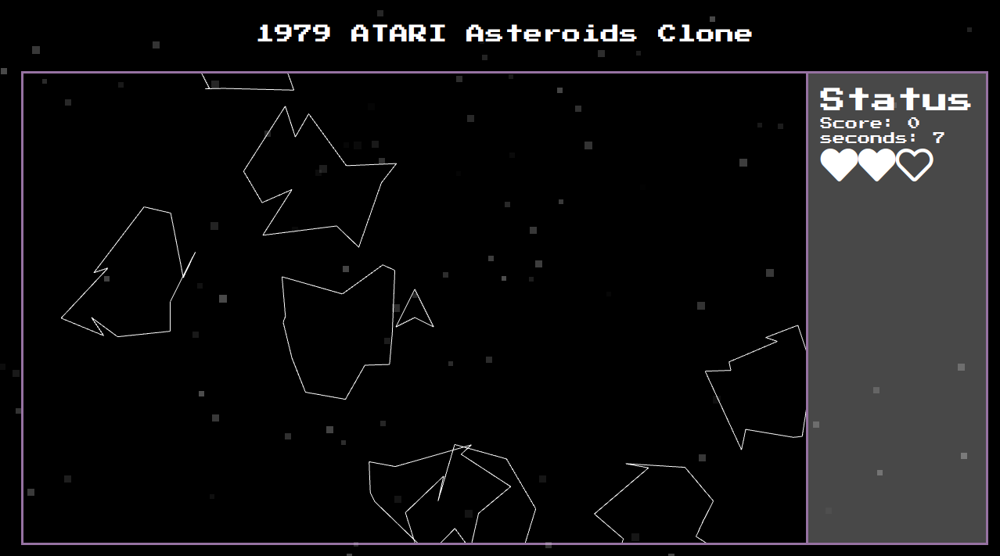
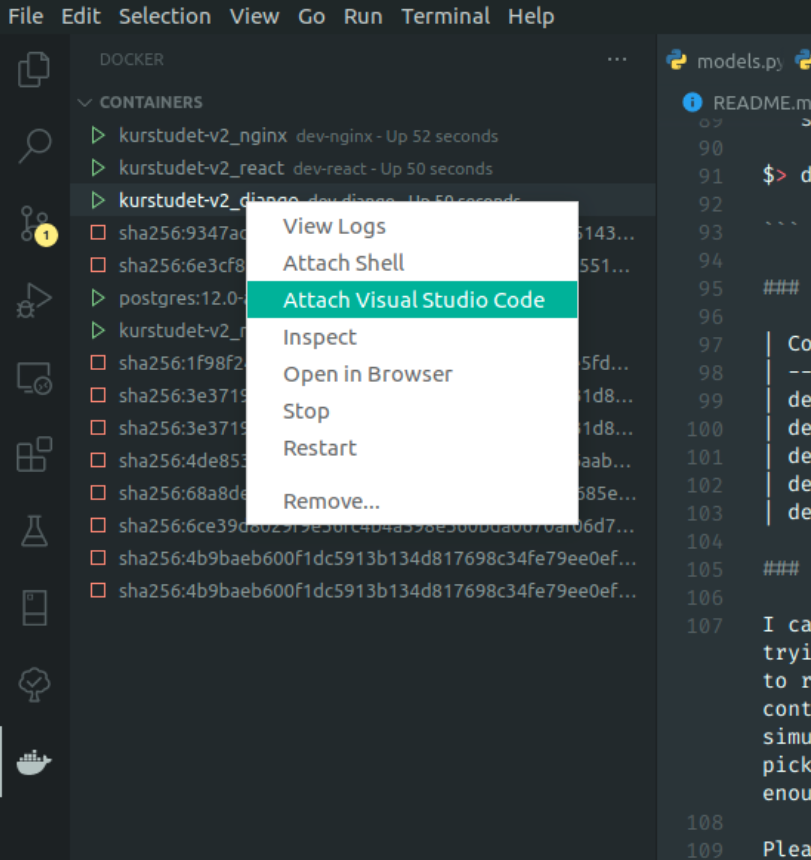

# Asteroid WASM

A small hobby/ school-project. Inspired by the ATARI Asteroid game, this is an
implementation in React/Rust/WebGL/Wasm. Feel free to use the code as you please.



The SPA also includes some other sections but they are nowhere as interesting as the game itself.

## Main Frameworks/Libraries/Packages

ExpressJS

- Node dev server via Docker LTS alpine image
- TypeScript/ESlint with very opinionated rules

React

- Create React App
- Hot reload
- TypeScript/ESlint with very opinionated rules
- SASS support
- WebAssembly support
- Integration with the Rust-Wasm module
- RUST INTEGRATION:
  - Compilation on code change straight to WASM with all type definitions
  - Rust 2018 edition
  - wasm-bindgen for WEB APIs

Neo4j Graph database

- Docker neo4j:4.1.4 image

Ngnix

- Docker stable alpine

Rust


### Useful Commands

Build containers. Add -up flag to bring services up after build.

```sh

$> docker-compose build

```

Bring containers up. Add -d flag to run output detached from current shell.

```sh

$> docker-compose up

```

Bring containers down. Add -v flag to also delete named volumes

```sh

$> docker-compose down

```

View logs by service name.

```sh

$> docker-compose logs <service-name>

```

Enter shell for specified container (must be running)

```sh

$> docker exec -it <container-name> sh

```

### Containers, Services and Ports

| Container | Service | Host Port | Docker Port |
| --------- | ------- | --------- | ----------- |
| dev-node  | node    | 8001      | 8000        |
| dev-react | react   | 3001      | 3000        |
| dev-db    | db      | 5432      | 5432        |
| dev-nginx | nginx   | 8080      | 80          |

### Why NGINX for local dev

Please make all requests from your browser through http://localhost:8080 and
NGINX will happily redirect the request and proxy all your services so your
browser thinks it's all one and the same protocol/domain/port == CORS bliss.


## How to start developing in VSCode

1. Install the
   [Docker extensions](https://marketplace.visualstudio.com/items?itemName=ms-azuretools.vscode-docker)
   and
   [Remote container development extensions](https://marketplace.visualstudio.com/items?itemName=ms-vscode-remote.remote-containers)
2. Install [Docker](https://docs.docker.com/engine/install/) and
   [docker-compose](https://docs.docker.com/compose/install/)
3. Start the containers with `docker-compose up`
4. Open the Docker extension sidebar
5. Right click on the container you want to do development in
6. Select `Attach Visual Studio Code`
   
